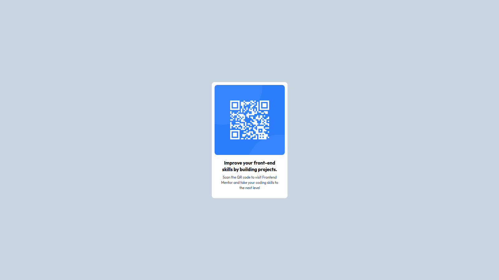

# Frontend Mentor - QR code component solution

This is a solution to the [QR code component challenge on Frontend Mentor](https://www.frontendmentor.io/challenges/qr-code-component-iux_sIO_H). Frontend Mentor challenges help you improve your coding skills by building realistic projects.

## Table of contents

- [Frontend Mentor - QR code component solution](#frontend-mentor---qr-code-component-solution)
  - [Table of contents](#table-of-contents)
  - [Overview](#overview)
    - [Screenshot](#screenshot)
    - [Links](#links)
  - [My process](#my-process)
    - [Built with](#built-with)
    - [What I learned](#what-i-learned)
    - [Continued development](#continued-development)
    - [Useful resources](#useful-resources)
  - [Author](#author)

## Overview

### Screenshot



### Links

- [Solution URL](https://github.com/babyanonymouse/frontendmentor-qr-code)
- [Live site URL here](https://frontmentorqr.netlify.app/)

## My process

### Built with

- Semantic HTML5 markup
- TailwindCSS

### What I learned

I learnt how to use **flexbox** using _tailwindcss_.

```html
<div class="flex-col min-h-screen flex items-center justify-center"></div>
```

linking html with tailwind using the config file and css

```js
  content: ["./*.html"],
```

```css
@tailwind base;
@tailwind components;
@tailwind utilities;
```

### Continued development

flexbox is easy but complex in some way. This needs more work

### Useful resources

- [Tailwind Docs](https://tailwindcss.com) - This helped me for know some tailwind class utils.

## Author

- Website - [Samuel Lwanga](https://babyanonymouse.github.io/Portfolio)
- Linktree - [Samuel Lwanga](https://linktr.ee/Samuel_Lwanga)
- Frontend Mentor - [@babyanonymouse](https://www.frontendmentor.io/profile/babyanonymouse)
- Twitter - [@Samuel Lwanga](https://www.twitter.com/BabyLilboss)
